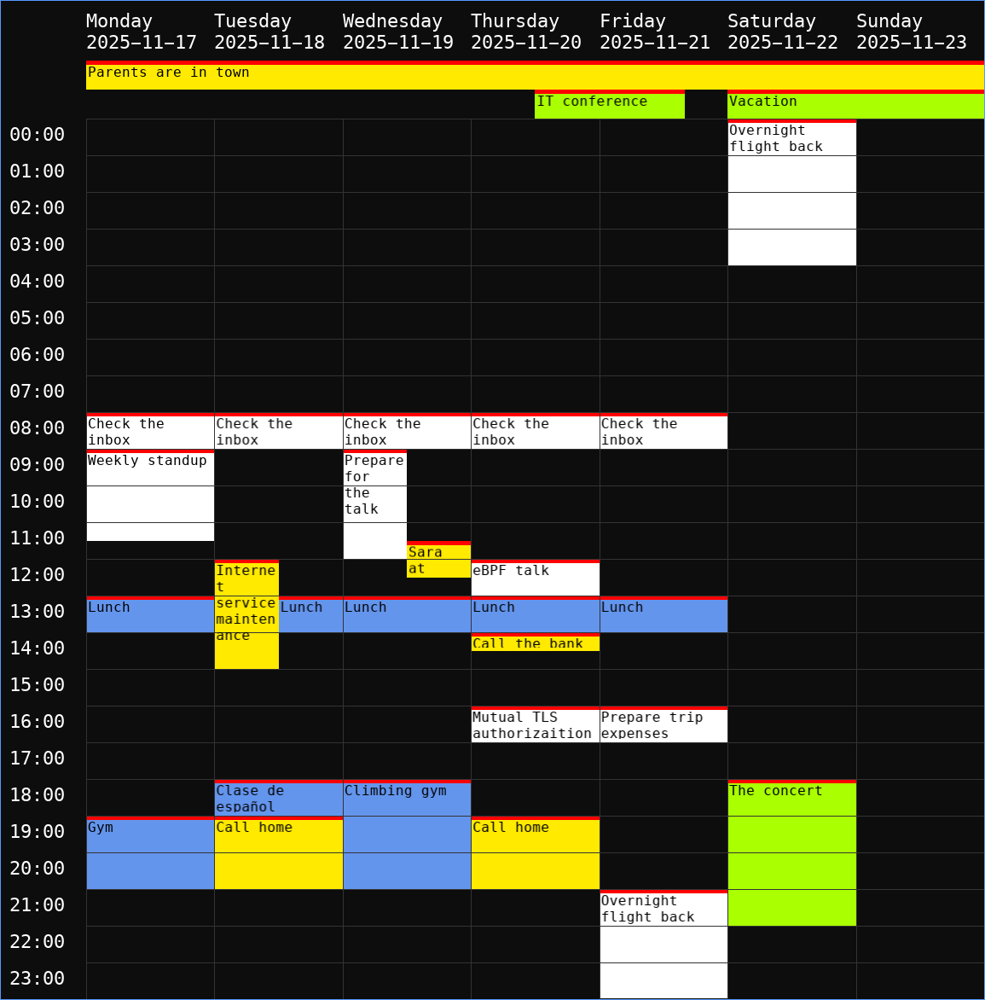

= Semana

A simple GUI calendar backed by link:https://lostpackets.de/khal/[Khal].
Currently has very limited functionality which narrowed down just to showing
the current week events.  Please, note that the project is a *proof of
concept*.

= Installation

Currently, the only way to install the program is to build it from sources.

== Building

Semana depends on the following software:

- Rust compiler
- Cargo package manager
- SDL3

To compile the project run:

[shell]
----
cargo build
----

For release build run:

[shell]
----
cargo build --release
----

== Running

The project depends on Khal 0.11.4.  Make sure that `khal` is available in your
PATH.  If `khal` is not available, run Semana with the environment variable:

----
SEMANA_BACKEND_BIN=/path/to/khal
----

Once the project is built, run either `cargo run`, or `target/debug/semana`, or
`target/release/semana` the project's been built with `--release`.
